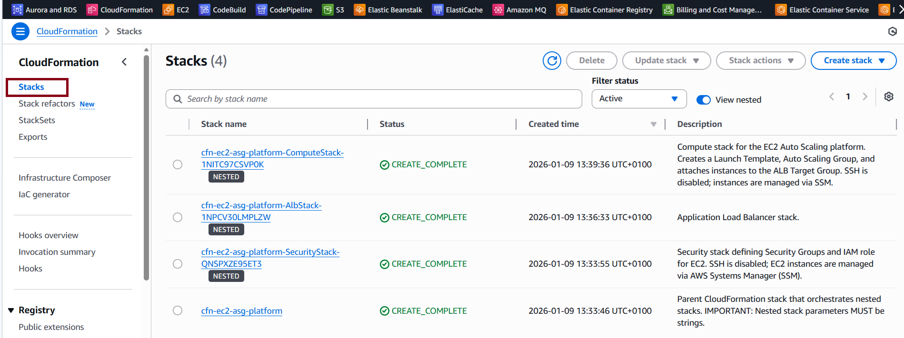
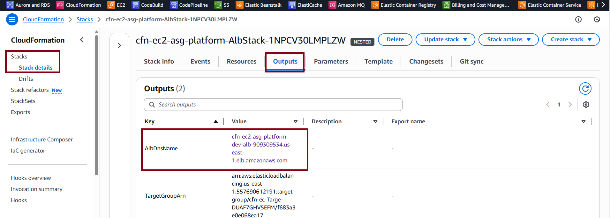
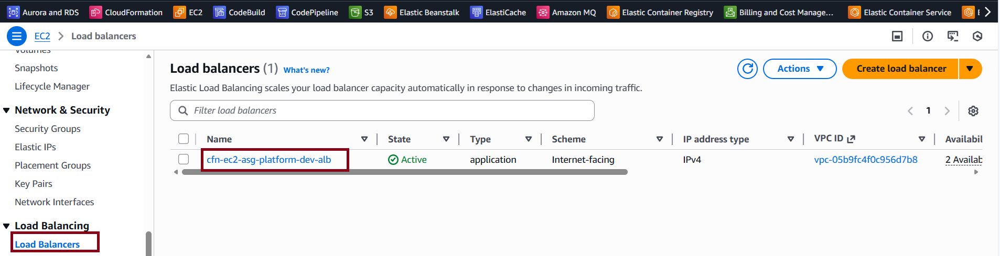
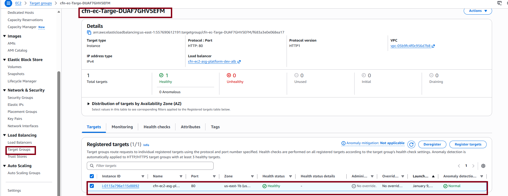
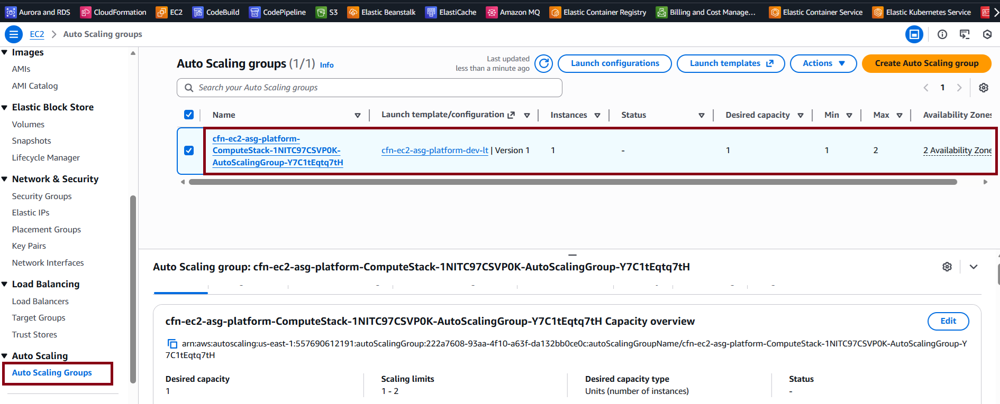
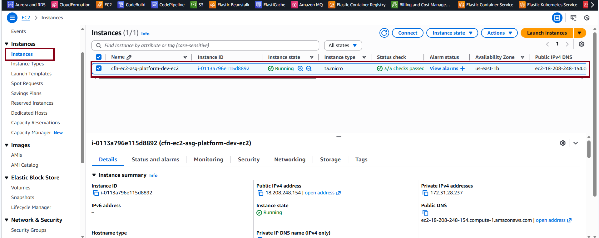
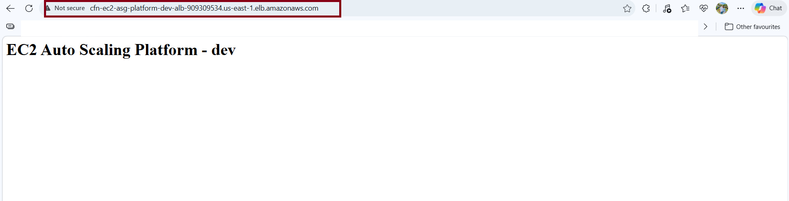
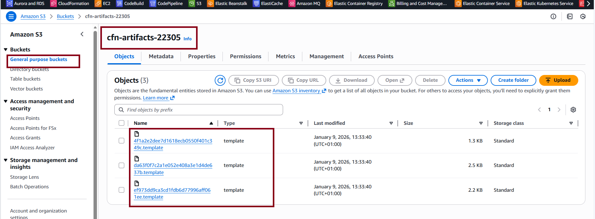

# AWS CloudFormation EC2 Auto Scaling Platform

A **production-ready Infrastructure-as-Code project** built using **AWS CloudFormation**.
This repository demonstrates how to design, deploy, and operate a **scalable, secure EC2 Auto Scaling platform** using modular and maintainable CloudFormation templates.

---

## 🚀 Key Features

* Application Load Balancer (ALB)
* EC2 Auto Scaling Group (ASG)
* Launch Templates
* Target Tracking Scaling Policy (CPU-based)
* AWS Systems Manager (SSM) instead of SSH
* Nested CloudFormation Stacks
* Secure-by-design architecture

---

## 🏗 Architecture Overview

This project uses **nested CloudFormation stacks**, where each stack has a clear and single responsibility.

**Traffic flow:**

1. Internet traffic reaches the Application Load Balancer
2. ALB forwards HTTP traffic to EC2 instances
3. EC2 instances run inside an Auto Scaling Group
4. Auto Scaling adjusts capacity based on CPU utilization
5. EC2 instances are managed via AWS Systems Manager (no SSH)

---

## 📁 Repository Structure

```text
aws-cloudformation-ec2-autoscaling-platform/
├── images/
│   ├── 01-cloudformation-stacks-complete.png
│   ├── 02-cloudformation-outputs.png
│   ├── 03-alb-active.png
│   ├── 04-target-group.png
│   ├── 05-asg-created.png
│   ├── 06-ec2-running.png
│   ├── 07-browser-success.png
│   └── 08-S3-Bucket.png
│
├── templates/
│   ├── main.yaml        # Parent stack (orchestrates all nested stacks)
│   ├── security.yaml    # Security Groups + IAM Role (SSM access)
│   ├── alb.yaml         # Application Load Balancer resources
│   └── compute.yaml     # Launch Template + ASG + Scaling policies
│
├── params/
│   └── dev.json         # Environment-specific parameters
│
├── scripts/
│   ├── validate.sh      # CloudFormation template validation
│   ├── package.sh       # Upload nested stacks to S3
│   └── deploy.sh        # Deploy the CloudFormation stack
│
└── README.md
```

---

## 🧠 Design Decisions

### Why Nested Stacks?

Nested stacks improve:

* Separation of concerns
* Readability
* Maintainability
* Reusability

Each template does **one job only**.

---

### Why No SSH?

SSH access is **intentionally disabled**.

EC2 instances are managed using **AWS Systems Manager (SSM)**:

* No open port 22
* Reduced attack surface
* Better auditing and security

This mirrors real-world production environments.

---

### Why Default VPC?

The goal of this project is to focus on:

* Auto Scaling
* Load Balancing
* Infrastructure design

Using the default VPC keeps the project simple while remaining realistic.

---

## 📋 Prerequisites

* AWS account
* AWS CLI installed and configured
* Default VPC available in the region
* IAM permissions to create:

  * EC2
  * Auto Scaling
  * ALB
  * IAM roles
  * S3 buckets
  * CloudFormation stacks

---

## ⚙️ Deployment Steps

### 1️⃣ Make scripts executable

```bash
chmod +x scripts/*.sh
```

### 2️⃣ Configure parameters

Edit `params/dev.json` and set:

* Default VPC ID
* At least two subnet IDs from the same VPC

### 3️⃣ Validate templates

```bash
./scripts/validate.sh
```

### 4️⃣ Package nested stacks

```bash
./scripts/package.sh
```

### 5️⃣ Deploy the stack

```bash
./scripts/deploy.sh
```

After deployment:

* Open the CloudFormation console
* Copy the ALB DNS name from Outputs
* Open it in your browser

---

## 📈 Auto Scaling Configuration

* Minimum capacity: **1**
* Desired capacity: **2**
* Maximum capacity: **4**
* Scaling policy: **Target Tracking (Average CPU = 50%)**

---

## 🔐 Security Summary

* No SSH access
* EC2 accepts traffic **only from ALB**
* ALB accepts HTTP traffic from the internet
* Least-privilege IAM roles
* IMDSv2 enforced on EC2 instances

---

## 📸 Deployment Screenshots

### 1. CloudFormation – Stacks Created Successfully



### 2. CloudFormation – Stack Outputs



### 3. Application Load Balancer – Active



### 4. Target Group Created



### 5. Auto Scaling Group Created



### 6. EC2 Instances Running



### 7. Application Accessible via Load Balancer



### 8. S3 Bucket for CloudFormation Artifacts



---

## ✅ What This Project Demonstrates

* Infrastructure as Code with CloudFormation
* Modular, production-ready design
* Secure EC2 access using AWS Systems Manager
* Auto Scaling based on real metrics
* Clean and professional GitHub repository structure
